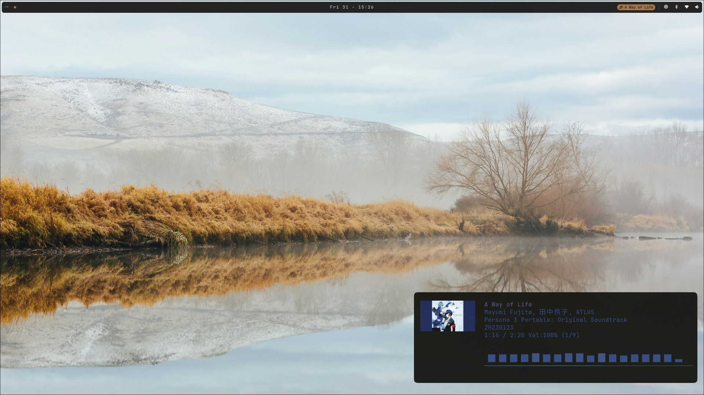

# desktop

A Quickshell config that runs the navbar and omni-menu command palette in a single process. One daemon, one live palette, atomic theme swaps across bar and palette.



## Quick start

```sh
qs -n -d -c desktop
```

See `~/.config/hypr/hyprland.lua` for the autostart entry.

## Surfaces

The palette ships two `GlobalShortcut`s, registered as `quickshell:locus-toggle` and `quickshell:locus-quick` (bind them globally in Hyprland to skip the `qs` client fork on the hot path). `locus-quick` opens pre-pivoted to the Quick-mode tile grid (battery, audio, wifi, bluetooth, weather, display, aether, cpu, calendar, screenshots, videos, power).

Everything else goes through IPC:

```sh
qs -c desktop ipc call locus toggle            # command palette
qs -c desktop ipc call locus openCategory Quick # palette pinned to Quick mode
qs -c desktop ipc call screenshots toggle      # screenshots browser
qs -c desktop ipc call videos toggle           # video browser
qs -c desktop ipc call display toggle          # display sliders
qs -c desktop ipc call weather toggle          # weather popup
qs -c desktop ipc call aether toggle           # aether blueprint picker
qs -c desktop ipc call calendar toggle         # calendar
qs -c desktop ipc call system toggle           # system popup (cpu, mem, btop)
qs -c desktop ipc call nightlight toggle       # warmth/brightness night mode
qs -c desktop ipc call bar toggle              # hide/show bar
qs -c desktop ipc call screenrecord toggle     # screen recording controls
qs -c desktop ipc call wireproton toggle       # VPN wireguard connect/disconnect
qs -c desktop ipc call locusfavs toggle        # folder bookmarks
qs -c desktop ipc call hyprland toggle         # hyprland keybind viewer
```

The navbar menu button calls `toggle()` on the sibling palette in-process, no IPC round-trip or subprocess.

## What's inside

| Component | What it does |
| --- | --- |
| Bar | Kanji workspace markers, telemetry (cpu, mem, bt, wifi, audio, battery), centred clock, click-through popups for calendar, screenshots, videos, display, weather, aether blueprints. |
| Locus | Full-screen command palette over installed apps and the omarchy-menu (Style, Setup, Install, Remove, Update, System, Toggle, Trigger, Capture, Share, Learn), file search, GitHub repo search, processes, theme picker, plus Quick-mode tile grid, tldr lookup (`$`), and local Ollama chat (`?`). |
| Theme | Shared live palette sourced from `~/.config/aether/theme/colors.toml`. Drift animation runs on theme swap so bar + palette breathe in sync. |

## Bar layout

```
left   | ws1..ws10 |
center | HH:MM |
right  | music | sep | weather | cpu | bt | wifi | audio | update | battery | recording | edge |
```

- Click the clock to open the calendar popup.
- Click a kanji to `hyprctl dispatch workspace N`.
- Click weather for the forecast popup. Right-click force-refreshes.
- Click cpu for the system popup (cpu, mem, btop).
- Click audio for `pavucontrol`. Right-click toggles mute. Scroll for volume.
- Click battery for the power menu.
- Click recording for the screen record popup.
- Click the edge arrow to cycle the bar between top, right, bottom, left.
- Toggle bar visibility with `qs -c desktop ipc call bar toggle`.

## Palette

Type to filter across titles, categories, and a curated synonym list. Drill into any category, run with Enter.

| Key | Action |
| --- | --- |
| Type | Filter by title, category, and per-item synonyms |
| Up / Down / Tab / Shift+Tab | Move selection, wraps at both ends |
| PageUp / PageDown | Jump 8 rows, clamps at both ends |
| Home / End | Jump to first / last result |
| Enter | Drill into a category, or run the selected action |
| Ctrl + S | Star / unstar the current row |
| Ctrl + Plus / Minus | Bump font scale (0.7x to 2.0x) |
| Ctrl + = | Reset font scale to 1.0 |
| Ctrl + C | In tldr / chat preview, copy selection (or whole rendered preview if nothing is selected) |
| Backspace | Delete a char; when empty, walk back up one level |
| Esc | Cascade: collapse quick-tile detail, then clear query, then unwind drill-down, then close |

### Query shapes

The first character of the query can pivot the whole pane:

| Prefix | Mode |
| --- | --- |
| `$ <cmd>` | tldr lookup. Renders the tldr page inline in a preview pane, palette-tinted. Enter opens a floating terminal with the command pre-filled at a readline prompt. |
| `? <question>` | Local Ollama chat. Streams against `qwen3.5:0.8b` (no network). First Enter probes the daemon; if Ollama isn't installed / running / the model isn't pulled, the preview shows what to do and Enter runs the right setup step in a terminal. |

### Quick mode

`ALT + SPACE` opens the palette pre-pivoted to a Samsung-style 4x3 tile grid: battery, audio, network, bluetooth, weather, display, aether, cpu, calendar, screenshots, videos, power. Each tile binds to live navbar telemetry so the panel paints with current state on the very first frame.

| Key | Action |
| --- | --- |
| Hjkl / arrow keys | Move tile selection |
| Tab / Shift+Tab | Step forward / backward through the grid |
| Enter | Expand the selected tile into a detail panel beside the grid |
| Right-click on tile | Run the tile's long action (mute toggle, refresh, reset) without opening detail |
| Esc | Collapse the detail panel, then close the palette |

Expanding a tile compresses the grid to a 64px column on the left so the detail body (volume sliders, wifi list, bluetooth pairing, display warmth/brightness/gamma, aether blueprints, screenshot/video browsers, ...) gets the wider right half.

### Scoring

Every entry is indexed against three fields. All query tokens must match somewhere; scores stack per token.

| Match | Weight |
| --- | --- |
| Title prefix | 100 |
| Title substring | 60 |
| Keywords substring | 20 |
| Category substring | 10 |

Top 250 sorted by score, nav-rows-first on ties, then alpha.

### Drill-downs

At root the first rows are category navigators (`Apps >`, `Style >`, `Files >`, `GitHub >`, `Processes >`, `Themes >`, ...). Activating one filters the list and updates the header breadcrumb. Files and GitHub drills pivot to fd / gh CLI output; Processes drills into a kill list; Themes drills into the aether theme switcher with swatch + preview pane.

## Theme

Reads `~/.config/aether/theme/colors.toml` and remaps:

| toml key | role | maps to |
| --- | --- | --- |
| background | surface base | `paper` |
| foreground | primary text | `ink` |
| color7 | secondary bright text | `inkDeep` |
| color8 | muted decoration | `sumi` |
| accent | info accent | `indigo` |
| color1 | active marker, alerts | `seal` (drift-modulated) |

Parsing lives in `Palette.js`:

- `parseAll(text)` returns every `key = "value"` pair from a colors.toml.
- `mapKeys(raw)` renames the six keys this shell uses onto semantic slots.
- `parse(text)` is `parseAll` + `mapKeys`, a one-shot convenience.
- `apply(theme, palette)` writes a parsed palette onto the live `Theme` instance.

### Push via aether

`aether --apply-blueprint <name>` (or the aether GUI) writes `colors.toml` to the theme directory, then runs `~/.config/quickshell/desktop/scripts/aether-push-theme.sh` which parses the file and calls `qs -c desktop ipc call theme apply` with a JSON payload. The `Theme.qml` `IpcHandler` dispatches it to `Palette.apply()`, which updates the live colour properties.

Additionally, the `FileView` in `Theme.qml` watches `colors.toml` with `watchChanges: true` as a fallback — if the file changes on disk, it re-parses and applies automatically.

On apply, `seal` saturation rides a 200ms rise and 2.8s taper (`driftDelay` + `driftAnim` in `Theme.qml`), so a theme swap reads as a deliberate breath rather than a hard cut.

### Payload shape

```json
{
  "name": "kanagawa-dragon",
  "colors": {
    "background": "#181616",
    "foreground": "#c5c9c5",
    "accent":     "#658594",
    "color1":     "#c4746e",
    "color7":     "#c8c093",
    "color8":     "#a6a69c",
    "color0":     "#0d0c0c",
    "color9":     "...",
    "...":        "..."
  }
}
```

`colors` is every `key = "value"` pair from the active `colors.toml` (typically ~22: `background`, `foreground`, `accent`, `cursor`, `selection_foreground`, `selection_background`, `color0..color15`).

### External listeners

```sh
# sed strips dbus-monitor's `string "..."` wrapper from the arg line.
dbus-monitor --session "type='signal',interface='org.omarchy.Theme',member='Changed'" \
  | grep --line-buffered '"name"' \
  | sed -u 's/^[[:space:]]*string "//; s/"$//' \
  | while read -r json; do
      bg=$(echo "$json" | jq -r '.colors.background')
      echo "new background: $bg"
    done
```

## IPC

`toggle`, `open`, `close`, and (where relevant) `refresh`, `reset`, `blank` are exposed on each target. `locus` also exposes `openCategory <name>` to pivot the palette into a drill-down on open. `qs -c desktop ipc show` lists everything. See [Surfaces](#surfaces) above for the common verbs.

## Weather location

Defaults to wttr.in's IP geolocation. Override by writing a single line to `~/.config/omarchy/weather/location`:

```
Oslo
```

Or any of: `City, Country` | `LHR` (IATA) | `94103` (zip) | `60.42,11.24` (lat,lon). Click the subtitle inside the weather popup to open the file in your editor; the bar re-fetches on save.

## App scan

Apps are scanned once at startup via a single Python `configparser` pass (NoDisplay/Hidden filtered, `%U`/`%f` field codes stripped, deduped by name) across `~/.local/share/applications`, `/usr/share/applications`, Flatpak, and Snap. Trigger a rescan with `qs -c desktop ipc call palette refresh`.

App icons resolve via `Quickshell.iconPath()` for theme names and `file://` for absolute paths, then render through `MultiEffect colorization` so they paint as flat-tinted silhouettes in the live palette (ink at rest, seal on the selected row).

## Adding palette entries

Edit `omarchyItems` in `Data.js`. Each row is:

```js
{ title: "My Action", icon: "", category: "Style",
  keywords: "synonym one synonym two related terms",
  exec: "my-command --flag" }
```

- `category` decides which drill-in surfaces the row.
- `keywords` is a space-separated synonym list. Anything you'd plausibly type to find this row goes here.
- `exec` is fed to `setsid -f uwsm-app -- bash -c "<exec>"`, so pipes, `||`, `&&` all work.

## Customization

Everything lives under `desktop/`. The palette is split between `OmniMenu.qml` (state, search, IPC, shortcuts, key handler, panel chrome) and the visual chunks in `omni/`:

| File | Owns |
| --- | --- |
| `omni/HeaderBar.qml` | Title row, breadcrumb, live result count, key-hint footer hint. |
| `omni/SearchInput.qml` | Magnifier glyph, query text, blinking caret. Hidden in Quick mode. |
| `omni/QuickContainer.qml` | Quick-mode tile grid + tile detail panel + the per-tile `QuickXxxBody` switch. |
| `omni/ResultList.qml` | ListView and row delegate (icon, title, favourite star, category label). |
| `omni/PreviewPane.qml` | Preview header and body for file / gh / proc / theme / tldr / chat modes. |
| `omni/Footer.qml` | Exec line for the selected item. |
| `omni/Format.js` | Markdown formatters for the tldr and chat previews. |
| `omni/Tiles.js` | Quick-tile static data + dynamic builder against navbar telemetry. |

Common tweaks:

| Want to change | Where |
| --- | --- |
| Bar height | `barHeight` in `Navbar.qml`. |
| Workspace count | `Repeater { model: 10 ... }` in `Bar.qml`. |
| Bar font | `mono` / `serif` in `Navbar.qml`. |
| Palette font | `mono` / `serif` in `OmniMenu.qml`. |
| Palette result cap | `maxResults` in `OmniMenu.qml`. |
| Score weights | `scPrefix`, `scTitle`, `scKw`, `scCat` in `OmniMenu.qml`. |
| Quick-tile order / actions | `base` array in `omni/Tiles.js`. |
| Telemetry interval | `Timer { interval: ... }` blocks in `Navbar.qml`. |
| Drift animation | `driftDelay` / `driftAnim` in `Theme.qml`. |

Quickshell hot-reloads on save, so edits show up live.

## Autostart

`qs -n -d -c desktop` in `hyprland.conf` via `exec-once`. `-d` daemonizes, `-n` makes it idempotent.

## Requirements

| Package | Why |
| --- | --- |
| quickshell | Runtime. |
| hyprland | Workspace state, keybinds, autostart. |
| aether | Live theme palette generation and application. |
| python3 | Parses `.desktop` files. |
| uwsm | `uwsm-app` scope wrapper for spawned apps. |
| pamixer | Audio mute query. |
| bluetoothctl | Bluetooth power and connection state. |
| nmcli | Wifi signal strength when no ethernet is up. |
| brightnessctl | Backlight slider in the display popup. |
| hyprsunset | Color temperature and gamma in the display popup. |
| jq, curl | Weather popup data fetch from wttr.in. |
| fd, gh | File search and GitHub repo search drill-downs (optional). |
| dragon-drop | Drag-and-drop hand-off for the videos popup (optional, AUR). |

## Troubleshooting

| Symptom | Fix |
| --- | --- |
| `Could not open config file at "desktop"` | Use `-c desktop`, not `-p desktop`. `-c` resolves to `~/.config/quickshell/desktop/shell.qml`. |
| Palette doesn't appear on SUPER + SPACE | Confirm the keybind targets `qs -c desktop ipc call locus toggle`. |
| Theme colours don't update on theme swap | Check that aether is generating `~/.config/aether/theme/colors.toml` and the push script at `~/.config/quickshell/desktop/scripts/aether-push-theme.sh` runs without error. |
| Workspace switch feels laggy | Bump `wsProbe`'s `Timer { interval: ... }` from 500ms down to 150ms in `Navbar.qml`, or wire it to Hyprland's IPC socket. |
| Qt version mismatch warning | `quickshell` was built against an older Qt minor. Rebuild the package against your current Qt. |

## License

MIT.
